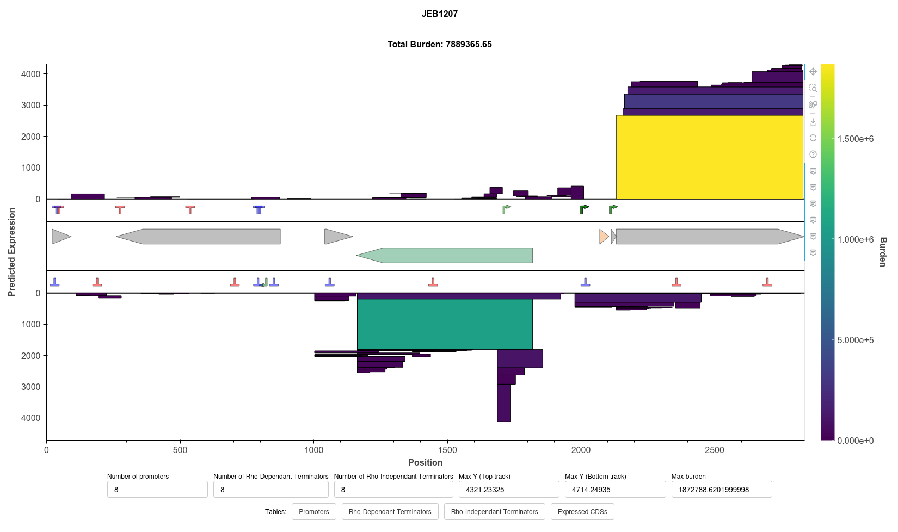

# cryptkeeper


Cryptkeeper is a computational pipeline designed to predict the presence of open reading frames that are burdensome due to substantial ribosome sequestration on plasmids, particularly virus infectious clones. Cryptkeeper also uses other prediction tools, such as promoter prediction and terminator prediction, to provide additional context. Burden from strongly expressed, long open reading frames have been found to render plasmids evolutionarily unstable or unclonable. In addition to highlighting burden from ribosome absorption, we've also found that Cryptkeeper is capable of displaying alternative translation initiation sites that lead to protein truncations. This is an important consideration for experiments that rely on protein fusions or tagging.


Cryptkeeper provides an output in the form of CSV files (for downstream data processing), an SVG of the resulting graph, and a Bokeh plot for interactive visualization.



Above is an example of a Bokeh plot produced by Cryptkeeper. The two outer tracks display predicted RBS strength versus sequence position (the product being 'burden'). The inner tracks display predicted promoters (green), rho-dependent terminators (red), and rho-independent terminators (purple). The innermost track displays annotations extracted from the provited genbank file.


# Quick Start
## Installation


### For Developers
Cryptkeeper is currently in development. Adventurous users can install dependencies on their own through other means. The simplest way to install Cryptkeeper is through conda by:


* Cloning this repository to your machine
* `conda env create -f environment.yml`
* `conda activate cryptkeeper`
* `pip install ./`


Cryptkeeper is also available through pip, but requires manual installation of ViennaRNA and an appropriate Selenium configuration (for generating SVG figures).


## Command Line Usage Usage


```
cryptkeeper -h
usage: cryptkeeper [-h] -i I [-c] -o O [-j J] [-p] [-n NAME] [--rbs-score-cutoff RBS_SCORE_CUTOFF] [-t TICK_FREQUENCY]


Pipeline for predicting cryptic gene expression


optional arguments:
 -h, --help            show this help message and exit
 -i I, --input I       input fasta file
 -c, --circular        The input file is circular. (Note: Increases runtime)
 -o O, --output O      output file prefix
 -j J, -threads J      Number of threads/processes to use
 -p, --plot-only       plot mode, assumes output files all exist
 -n NAME, --name NAME  name of sample (if not provided the filename is used)
 --rbs-score-cutoff RBS_SCORE_CUTOFF
                       Minimum score that is graphed and output to final files (all are used in calculating burden)
 -t TICK_FREQUENCY     Y axis tick frequency (default 1000)
```


For example:
```javascript
cd examples/BPMV
cryptkeeper -i pSMART-LCKan-BPMV1.fna -o output/pSMART-LCKan-BPMV1 -j 8 -c
```


## Python Usage


In certain situations, it may be valuable to use cryptkeeper as a python dependency for another pipeline.
The primary entry point for python development is `cryptkeeper.cryptkeeper()`, which has the following arguments:


```
input_file : str
   Path to the input sequence file in FASTA format.
output : str, optional
   Path to the output file directory. If not provided, Cryptkeeper will write the results to a temporary directory.
circular : bool, optional
   If True, Cryptkeeper will extend the sequence by a few bases while making predictions. This is necessary for predicting terminators and RBS sites at the index and end of a file. Defaults to False.
name : str, optional
   Name of the sequence. If not provided, Cryptkeeper will attempt to extract the name from the genbank file if applicable.
threads : int, optional
   Number of threads to use for parallel processing. Defaults to 1.
logger : logging.Logger, optional
   Logger object to use for logging. If not provided, Cryptkeeper will run without logging.
rbs_score_cutoff : float, optional
   Minimum score required for an RBS site to be considered expressed. Default is 2.0.
```


This function returns an object that contains predictions made by Cryptkeeper as well as some metadata information extracted directly from an input Genbank file if one is provided. The object has the following attributes:


* `name`: the name of the sample in the form of a `str`
* `sequence`: the input sequence from the original file in the form of a `str`
* `translation_sites`: ORFs with predicted RBSs in the form of a `List[NamedTuple]`
* `rho_dep_terminators`: Predicted rho dependant termionators in the form of a `List[NamedTuple]`
* `rho_ind_terminators`: Predicted rho independent terminators in the form of a `List[NamedTuple]`
* `promoters`: Predicted promoters in the form of a `List[NamedTuple]`
* `annotations`: Annotations from the provided genbank file in the form of a List[NamedTuple]
* `burden`: The total predicted burden in the form of a `float`
